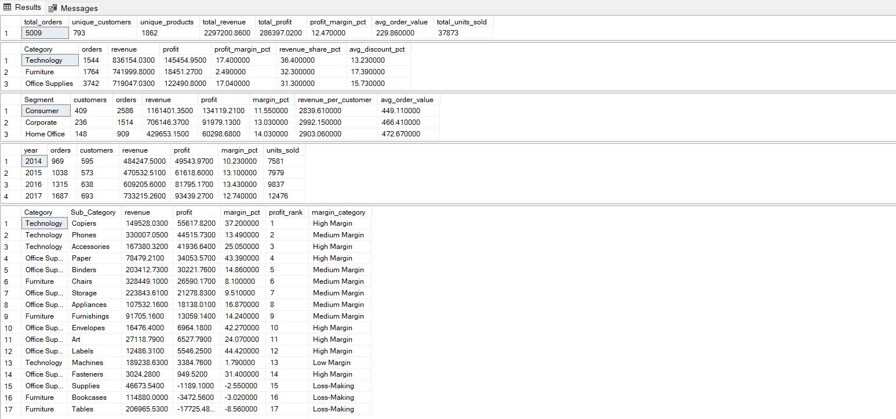

# 🛒 Retail Sales Analytics — SQL Project


## 📌 Project Overview

An end-to-end SQL analytics project on the **Retail client dataset** dataset — a US retail
company selling Office Supplies, Technology, and Furniture across four regions.
This project answers real business questions using advanced T-SQL techniques:
revenue performance, profitability, customer segmentation, regional trends,
discount impact, and shipping analysis.

> **Dataset:** Retail client dataset — 9,994 rows · 19 columns · 2014–2017  
> **Database:** Microsoft SQL Server (T-SQL)  
> **Skills:** Window Functions · CTEs · CASE WHEN · PIVOT · NULLIF ·
> NTILE · LAG · RANK · DATEDIFF · DATEFROMPARTS

---

## 🎯 Business Questions Answered

| # | Question | File |
|---|----------|------|
| 0 | Is the data clean and complete? What are the key metrics? | `0. Setup and Data Quality Audit.sql` |
| 1 | What is the overall revenue, profit, and margin by category/segment/year? | `1. Overview.sql` |
| 2 | Which products are most/least profitable? What is the 80/20 split? | `2. Product Analysis.sql` |
| 3 | Which regions and states drive revenue? Which states are loss-making? | `3. Regional Analysis.sql` |
| 4 | Who are our most valuable customers (RFM segmentation)? | `4. RFM Analysis.sql` |
| 5 | How is revenue trending month-over-month? | `5. Growth Analysis.sql` |
| 6 | How does discounting impact profit margins? | `6. Discount Analysis.sql` |
| 7 | Which orders and sub-categories are loss-making? | `7. Loss Analysis.sql` |
| 8 | How does shipping mode affect profitability? | `8. Shipping Analysis.sql` |

---

## 📂 Project Structure

```
Retail-sql-analytics/
│
├── README.md
│
├── sql/
│   ├── 0. Setup and Data Quality Audit.sql
│   ├── 1. Overview.sql
│   ├── 2. Product Analysis.sql
│   ├── 3. Regional Analysis.sql
│   ├── 4. RFM Analysis.sql
│   ├── 5. Growth Analysis.sql
│   ├── 6. Discount Analysis.sql
│   ├── 7. Loss Analysis.sql
│   └── 8. Shipping Analysis.sql
│
├── docs/
│   ├── data_dictionary.md
│   └── findings.md
│
└── screenshots/
    ├── 0. Setup and Data Quality Audit - Screenshot.png
    ├── 1. Overview - Screenshot.png
    ├── 2. Product Analysis - Screenshot.png
    ├── 3. Regional Analysis - Screenshot.png
    ├── 4. RFM Analysis - Screenshot.png
    ├── 5. Growth Analysis - Screenshot.png
    ├── 6. Discount Analysis - Screenshot.png
    ├── 7. Loss Analysis - Screenshot.png
    └── 8. Shipping Analysis - Screenshot.png
```

---

## 🔧 Setup Instructions

### Step 1 — Download dataset
```
client: https://www.client.com/datasets/vivek468/Retail-dataset-final
File: Retail.csv
```

### Step 2 — Clean the CSV (required before import)
Run the Python cleaning script to fix mixed date formats and
quoted product names that confuse SQL Server BULK INSERT:
```bash
python Data_Cleaning.py
# Output: clean_retail_data.csv
```

### Step 3 — Load into SQL Server
```sql
-- Update the file path, then run 0. Setup and Data Quality Audit.sql
BULK INSERT dbo.retail_sales
FROM 'C:\Users\dines\OneDrive\Desktop\Interview Stuff\Final Files\github-sql-FINAL\clean_retail_data.csv'
WITH (
    FORMAT     = 'CSV',
    FIRSTROW   = 2,
    FIELDQUOTE = '"',
    CODEPAGE   = '65001',
    TABLOCK
);
```

### Step 4 — Run query files in order
```
0. Setup and Data Quality Audit.sql   ← always run first
1. Overview.sql
2. Product Analysis.sql
3. Regional Analysis.sql
4. RFM Analysis.sql
5. Growth Analysis.sql
6. Discount Analysis.sql
7. Loss Analysis.sql
8. Shipping Analysis.sql
```

---

## 📊 Query Results & Screenshots

### 0. Setup & Data Quality Audit


**Verified load — all numbers match expected values:**

| Metric | Result |
|--------|--------|
| Total rows | 9,994 |
| Unique orders | 5,009 |
| Unique customers | 793 |
| Unique products | 1,862 |
| Earliest order | 2014-01-03 |
| Latest order | 2017-12-30 |
| Total revenue | $2,297,200.86 |
| Total profit | $286,397.02 |

**Data quality checks — all passed:**

| Check | Result | Status |
|-------|--------|--------|
| Null Customer_ID | 0 | ✅ |
| Null Product_Name | 0 | ✅ |
| Negative profit rows | 1,871 | ✅ Real losses, not errors |
| Zero or negative sales | 0 | ✅ |
| Discount out of range (>0.8) | 0 | ✅ |
| Ship date before order date | 0 | ✅ |
| Duplicate Row_IDs | 0 | ✅ |

**Min/max sanity check:**

| Column | Min | Max |
|--------|-----|-----|
| Sales | $0.44 | $22,638.48 |
| Profit | -$6,599.98 | $8,399.98 |
| Discount | 0.0 | 0.8 (80%) |
| Quantity | 1 | 14 |
| Order Date | 2014-01-03 | 2017-12-30 |

**Row count by year:**

| Year | Rows | Unique Orders |
|------|------|---------------|
| 2014 | 1,993 | 969 |
| 2015 | 2,102 | 1,038 |
| 2016 | 2,587 | 1,315 |
| 2017 | 3,312 | 1,687 |

**Top 5 states by row count:**

| State | Region | Rows | Customers |
|-------|--------|------|-----------|
| California | West | 2,001 | 577 |
| New York | East | 1,128 | 415 |
| Texas | Central | 985 | 370 |
| Pennsylvania | East | 587 | 257 |
| Washington | West | 506 | 224 |

---

### 1. Overview


**Executive KPI Summary:**

| Metric | Value |
|--------|-------|
| Total orders | 5,009 |
| Unique customers | 793 |
| Unique products | 1,862 |
| Total revenue | $2,297,200.86 |
| Total profit | $286,397.02 |
| Profit margin % | 12.47% |
| Avg order value | $458.61 |
| Total units sold | 37,873 |

**Revenue & Profit by Category:**

| Category | Orders | Revenue | Profit | Margin | Revenue Share | Avg Discount |
|----------|--------|---------|--------|--------|---------------|--------------|
| Technology | 1,544 | $836,154.03 | $145,454.95 | 17.40% | 36.40% | 13.23% |
| Furniture | 1,764 | $741,999.80 | $18,451.27 | 2.49% | 32.30% | 17.39% |
| Office Supplies | 3,742 | $719,047.03 | $122,490.80 | 17.04% | 31.30% | 15.73% |

**Performance by Segment:**

| Segment | Customers | Orders | Revenue | Profit | Margin | Rev/Customer | Avg Order |
|---------|-----------|--------|---------|--------|--------|--------------|-----------|
| Consumer | 409 | 2,586 | $1,161,401.35 | $134,119.21 | 11.55% | $2,839.61 | $449.11 |
| Corporate | 236 | 1,514 | $706,146.37 | $91,979.13 | 13.03% | $2,992.15 | $466.41 |
| Home Office | 148 | 909 | $429,653.15 | $60,298.68 | 14.03% | $2,903.06 | $472.67 |

**Yearly Performance:**

| Year | Orders | Customers | Revenue | Profit | Margin | Units Sold |
|------|--------|-----------|---------|--------|--------|------------|
| 2014 | 969 | 595 | $484,247.50 | $49,543.97 | 10.23% | 7,581 |
| 2015 | 1,038 | 573 | $470,532.51 | $61,618.60 | 13.10% | 7,979 |
| 2016 | 1,315 | 638 | $609,205.60 | $81,795.17 | 13.43% | 9,837 |
| 2017 | 1,687 | 693 | $733,215.26 | $93,439.27 | 12.74% | 12,476 |

**Sub-Category Profitability Ranking:**

| Rank | Category | Sub-Category | Revenue | Profit | Margin | Label |
|------|----------|-------------|---------|--------|--------|-------|
| 1 | Technology | Copiers | $149,528.03 | $55,617.82 | 37.20% | High Margin |
| 2 | Technology | Phones | $330,007.05 | $44,515.73 | 13.49% | Medium Margin |
| 3 | Technology | Accessories | $167,380.32 | $41,936.64 | 25.05% | High Margin |
| 4 | Office Supplies | Paper | $78,479.21 | $34,053.57 | 43.39% | High Margin |
| 5 | Office Supplies | Binders | $203,412.73 | $30,221.76 | 14.86% | Medium Margin |
| 6 | Furniture | Chairs | $328,449.10 | $26,590.17 | 8.10% | Medium Margin |
| 7 | Office Supplies | Storage | $223,843.61 | $21,278.83 | 9.51% | Medium Margin |
| 8 | Office Supplies | Appliances | $107,532.16 | $18,138.01 | 16.87% | Medium Margin |
| 9 | Furniture | Furnishings | $91,705.16 | $13,059.14 | 14.24% | Medium Margin |
| 10 | Office Supplies | Envelopes | $16,476.40 | $6,964.18 | 42.27% | High Margin |
| 15 | Office Supplies | Supplies | $46,673.54 | -$1,189.10 | -2.55% | **Loss-Making** |
| 16 | Furniture | Bookcases | $114,880.00 | -$3,472.56 | -3.02% | **Loss-Making** |
| 17 | Furniture | Tables | $206,965.30 | -$17,725.48 | -8.56% | **Loss-Making** |

> **Key Insight:** Tables, Bookcases, and Supplies are the only 3 loss-making
> sub-categories. Tables alone loses -$17,725 despite $207K in revenue —
> driven by a 26.1% average discount rate.

---

### 2. Product Analysis


**Top 10 Most Profitable Products:**

| Rank | Product | Sub-Category | Revenue | Profit | Margin | Times Ordered |
|------|---------|-------------|---------|--------|--------|---------------|
| 1 | Canon imageCLASS 2200 Advanced Copier | Copiers | $61,599.82 | $25,199.93 | 40.91% | 5 |
| 2 | Fellowes PB500 Electric Punch Plastic Comb Binding Machine | Binders | $27,453.38 | $7,753.04 | 28.24% | 10 |
| 3 | Hewlett Packard LaserJet 3310 Copier | Copiers | $18,839.69 | $6,983.88 | 37.07% | 8 |
| 4 | Canon PC1060 Personal Laser Copier | Copiers | $11,619.83 | $4,570.93 | 39.34% | 4 |
| 5 | HP Designjet T520 Inkjet Large Format Printer | Machines | $18,374.90 | $4,094.98 | 22.29% | 3 |
| 6 | Ativa V4110MDD Micro-Cut Shredder | Machines | $7,699.89 | $3,772.95 | 49.00% | 2 |
| 7 | 3D Systems Cube Printer - 2nd Generation - Magenta | Machines | $14,299.89 | $3,717.97 | 26.00% | 2 |
| 8 | Plantronics Savi W720 Multi-Device Wireless Headset | Accessories | $9,367.29 | $3,696.28 | 39.46% | 7 |

**Bottom 10 Loss-Making Products:**

| Rank | Product | Sub-Category | Revenue | Profit | Avg Discount | Times Ordered |
|------|---------|-------------|---------|--------|--------------|---------------|
| 1 | Cubify CubeX 3D Printer Double Head Print | Machines | $11,099.96 | -$8,879.97 | 53.33% | 3 |
| 2 | Lexmark MX611dhe Monochrome Laser Printer | Machines | $16,829.90 | -$4,589.97 | 40.00% | 4 |
| 3 | Cubify CubeX 3D Printer Triple Head Print | Machines | $7,999.98 | -$3,839.99 | 50.00% | 1 |
| 4 | Chromcraft Bull-Nose Wood Oval Conference Tables | Tables | $9,917.64 | -$2,876.12 | 28.00% | 5 |
| 5 | Bush Advantage Collection Racetrack Conference Table | Tables | $9,544.73 | -$1,934.40 | 35.00% | 7 |
| 6 | GBC DocuBind P400 Electric Binding System | Binders | $17,965.07 | -$1,878.17 | 45.00% | 6 |
| 7 | Cisco TelePresence System EX90 Videoconferencing Unit | Machines | $22,638.48 | -$1,811.08 | 50.00% | 1 |
| 8 | Martin Yale Chadless Opener Electric Letter Opener | Supplies | $16,656.20 | -$1,299.18 | 10.00% | 6 |

**Pareto Analysis — 80/20 Rule:**

| Metric | Value |
|--------|-------|
| Products generating 80% of profit | 392 |
| Total profitable products | 1,803 |
| % of products needed for 80% of profit | **21.7%** |

> **Key Insight:** Just 21.7% of products (392 out of 1,803 profitable SKUs)
> generate 80% of all profit — a textbook Pareto distribution.

---

### 3. Regional Analysis


**Revenue & Profit by Region:**

| Region | Customers | Orders | Revenue | Profit | Margin | Rev Share | Rank |
|--------|-----------|--------|---------|--------|--------|-----------|------|
| West | 686 | 1,611 | $725,457.82 | $108,418.45 | 14.94% | 31.60% | 1 |
| East | 674 | 1,401 | $678,781.24 | $91,522.78 | 13.48% | 29.50% | 2 |
| South | 512 | 822 | $391,721.91 | $46,749.43 | 11.93% | 17.10% | 3 |
| Central | 629 | 1,175 | $501,239.89 | $39,706.36 | 7.92% | 21.80% | 4 |

**Top 10 States by Revenue:**

| State | Region | Revenue | Profit | Margin | Orders |
|-------|--------|---------|--------|--------|--------|
| California | West | $457,687.63 | $76,381.39 | 16.69% | 1,021 |
| New York | East | $310,876.27 | $74,038.55 | 23.82% | 562 |
| Texas | Central | $170,188.05 | -$25,729.36 | -15.12% | 487 |
| Washington | West | $138,641.27 | $33,402.65 | 24.09% | 256 |
| Pennsylvania | East | $116,511.91 | -$15,559.96 | -13.35% | 288 |
| Florida | South | $89,473.71 | -$3,399.30 | -3.80% | 200 |
| Illinois | Central | $80,166.10 | -$12,607.89 | -15.73% | 276 |
| Ohio | East | $78,258.14 | -$16,971.38 | -21.69% | 236 |
| Michigan | Central | $76,269.61 | $24,463.19 | 32.07% | 117 |
| Virginia | South | $70,636.72 | $18,597.95 | 26.33% | 115 |

**Loss-Making States (10 states with negative profit):**

| State | Region | Revenue | Profit | Avg Discount | Orders |
|-------|--------|---------|--------|--------------|--------|
| Texas | Central | $170,188.05 | -$25,729.36 | 37.02% | 487 |
| Ohio | East | $78,258.14 | -$16,971.38 | 32.49% | 236 |
| Pennsylvania | East | $116,511.91 | -$15,559.96 | 32.86% | 288 |
| Illinois | Central | $80,166.10 | -$12,607.89 | 39.00% | 276 |
| North Carolina | South | $55,603.16 | -$7,490.91 | 28.35% | 136 |
| Colorado | West | $32,108.12 | -$6,527.86 | 31.65% | 79 |
| Tennessee | South | $30,661.87 | -$5,341.69 | 29.13% | 91 |
| Arizona | West | $35,282.00 | -$3,427.92 | 30.36% | 108 |
| Florida | South | $89,473.71 | -$3,399.30 | 29.93% | 200 |
| Oregon | West | $17,431.15 | -$1,190.47 | 28.87% | 56 |

**Category Revenue & Profit by Region (CASE WHEN Pivot):**

| Region | Tech Revenue | Furn Revenue | Off Sup Revenue | Tech Profit | Furn Profit | Off Sup Profit |
|--------|-------------|-------------|-----------------|-------------|-------------|----------------|
| Central | $170,416.31 | $163,797.16 | $167,026.42 | $33,697.43 | -$2,871.05 | $8,879.98 |
| East | $264,973.98 | $208,291.20 | $205,516.06 | $47,462.04 | $3,046.17 | $41,014.58 |
| South | $148,771.91 | $117,298.68 | $125,651.31 | $19,991.83 | $6,771.21 | $19,986.39 |
| West | $251,991.83 | $252,612.74 | $220,853.25 | $44,303.65 | $11,504.95 | $52,609.85 |

> **Key Insight:** Central region has the lowest margin at 7.92%. Central/Furniture
> is the only negative profit cell in the matrix (-$2,871) — confirming that
> heavy discounting on Furniture in the Central region is the main driver of
> underperformance. Texas alone accounts for -$25,729 in losses.

---

### 4. RFM Analysis


**Top Champions (RFM Score = 12, highest possible):**

| Customer ID | Segment | Recency Days | Frequency | Monetary | R | F | M | Total | Segment |
|-------------|---------|-------------|-----------|----------|---|---|---|-------|---------|
| CS-12490 | Corporate | 424 | 4 | $1,077.23 | 4 | 4 | 4 | 12 | Champion |
| PC-19000 | Home Office | 882 | 2 | $1,061.49 | 4 | 4 | 4 | 12 | Champion |
| DP-13165 | Consumer | 812 | 2 | $1,058.62 | 4 | 4 | 4 | 12 | Champion |
| VS-21820 | Consumer | 221 | 4 | $1,055.98 | 4 | 4 | 4 | 12 | Champion |
| DH-13675 | Home Office | 776 | 4 | $1,043.10 | 4 | 4 | 4 | 12 | Champion |

**RFM Segment Summary:**

| Segment | Customers | Avg Revenue | Total Revenue | Revenue Share |
|---------|-----------|-------------|---------------|---------------|
| Lapsed / Others | 286 | $3,823.85 | $1,093,621.30 | 47.60% |
| Champion | 223 | $1,888.76 | $421,194.31 | 18.30% |
| At Risk | 173 | $2,327.75 | $402,701.10 | 17.50% |
| Loyal | 86 | $3,070.52 | $264,064.44 | 11.50% |
| New Customer | 25 | $4,624.79 | $115,619.70 | 5.00% |

> **Key Insight:** Champions (223 customers = 28.1% of base) generate 18.3%
> of revenue. The At Risk segment (173 customers) represents $402.7K in revenue
> at risk of churn — the highest-priority retention target.

---

### 5. Growth Analysis


**Monthly Revenue Trend (first 6 months shown):**

| Month | Revenue | Prev Revenue | MoM Growth | Profit | Cumulative Rev | 3M Rolling Avg |
|-------|---------|-------------|------------|--------|----------------|----------------|
| 2014-01 | $14,236.90 | NULL | NULL | $2,450.19 | $14,236.90 | $14,236.90 |
| 2014-02 | $4,519.89 | $14,236.90 | -68.30% | $862.31 | $18,756.79 | $9,378.40 |
| 2014-03 | $55,691.01 | $4,519.89 | +1,132.10% | $498.73 | $74,447.80 | $24,815.93 |
| 2014-04 | $28,295.35 | $55,691.01 | -49.20% | $3,488.84 | $102,743.15 | $29,502.08 |
| 2014-05 | $23,648.29 | $28,295.35 | -16.40% | $2,738.71 | $126,391.44 | $35,878.22 |
| 2014-06 | $34,595.13 | $23,648.29 | +46.30% | $4,976.52 | $160,986.57 | $28,846.26 |

> **Key Insight:** The rolling 3-month average smooths the volatile
> month-to-month swings and reveals the underlying growth trend.
> Revenue grew from $484K (2014) to $733K (2017) — a 51.5% increase over 4 years.

---

### 6. Discount Analysis


**Profit Margin by Discount Band:**

| Discount Band | Order Lines | Revenue | Profit | Margin | Avg Discount | Loss Lines |
|---|---|---|---|---|---|---|
| 0% (No discount) | 4,798 | $1,087,908.47 | $320,987.60 | 29.51% | 0.00% | 0 |
| 1-10% | 94 | $54,369.35 | $9,029.18 | 16.61% | 10.00% | 4 |
| 11-20% | 3,709 | $792,152.89 | $91,756.30 | 11.58% | 19.93% | 519 |
| 21-30% | 227 | $103,226.66 | -$10,369.28 | -10.05% | 30.00% | 208 |
| 31-40% | 233 | $130,911.24 | -$25,448.19 | -19.44% | 39.07% | 207 |
| 40%+ | 933 | $128,632.25 | -$99,558.59 | -77.40% | 70.03% | 933 |

**Avg Discount % by Sub-Category:**

| Sub-Category | Avg Discount | Margin | Total Profit | Loss Lines |
|---|---|---|---|---|
| Binders | 37.23% | 14.86% | $30,221.76 | 613 |
| Machines | 30.61% | 1.79% | $3,384.76 | 44 |
| Tables | 26.13% | -8.56% | -$17,725.48 | 203 |
| Bookcases | 21.11% | -3.02% | -$3,472.56 | 109 |
| Chairs | 17.02% | 8.10% | $26,590.17 | 235 |
| Appliances | 16.65% | 16.87% | $18,138.01 | 67 |
| Copiers | 16.18% | 37.20% | $55,617.82 | 0 |
| Phones | 15.46% | 13.49% | $44,515.73 | 136 |
| Furnishings | 13.83% | 14.24% | $13,059.14 | 167 |

> **Key Insight:** Orders with 0% discount yield a 29.51% margin. Orders with
> 40%+ discount yield a -77.40% margin, destroying $99,558.59 in profit.
> Orders above 20% discount are consistently loss-making.

---

### 7. Loss Analysis


**Loss-Making Orders Summary:**

| Metric | Value |
|--------|-------|
| Loss-making order lines | 1,871 |
| Total order lines | 9,994 |
| Loss % | **18.7%** |
| Total loss amount | **-$156,131.29** |

**Loss by Sub-Category (sorted worst first):**

| Sub-Category | Loss Lines | Total Loss | Avg Discount on Loss |
|---|---|---|---|
| Binders | 613 | -$38,510.50 | 73.80% |
| Tables | 203 | -$32,412.15 | 36.53% |
| Machines | 44 | -$30,118.67 | 58.18% |
| Bookcases | 109 | -$12,152.21 | 34.85% |
| Chairs | 235 | -$9,880.84 | 26.13% |
| Appliances | 67 | -$8,629.64 | 80.00% |
| Phones | 136 | -$7,530.62 | 34.26% |
| Furnishings | 167 | -$6,490.91 | 53.05% |
| Storage | 161 | -$6,426.30 | 20.00% |
| Supplies | 33 | -$3,015.62 | 20.00% |
| Accessories | 91 | -$930.63 | 20.00% |
| Fasteners | 12 | -$33.20 | 20.00% |
| Paper | 0 | $0.00 | NULL |
| Copiers | 0 | $0.00 | NULL |
| Labels | 0 | $0.00 | NULL |
| Art | 0 | $0.00 | NULL |
| Envelopes | 0 | $0.00 | NULL |

> **Key Insight:** Binders has the most loss-making order lines (613) with an
> astonishing 73.8% average discount on those loss lines. Paper, Copiers, Labels,
> Art, and Envelopes have zero loss-making orders — these sub-categories should
> be used as benchmarks for healthy discount policies.

---

### 8. Shipping Analysis


**Shipping Mode Performance:**

| Ship Mode | Orders | Revenue | Profit | Margin | Avg Ship Days | Rev Share |
|-----------|--------|---------|--------|--------|---------------|-----------|
| Standard Class | 2,994 | $1,358,215.74 | $164,088.79 | 12.08% | 5 days | 59.10% |
| Second Class | 964 | $459,193.57 | $57,446.64 | 12.51% | 3.2 days | 20.00% |
| First Class | 787 | $351,428.42 | $48,969.84 | 13.93% | 2.2 days | 15.30% |
| Same Day | 264 | $128,363.13 | $15,891.76 | 12.38% | 0 days | 5.60% |

> **Key Insight:** First Class has the highest profit margin (13.93%) despite
> faster delivery. Standard Class handles 59.1% of all revenue. Same Day
> delivery shows 0 average ship days confirming it processes and ships on the
> same calendar day as the order.

---

## 🧠 SQL Techniques Demonstrated

| Technique | Used In |
|-----------|---------|
| `WINDOW FUNCTIONS` (RANK, DENSE_RANK, NTILE, LAG, SUM OVER) | All files |
| `CTEs` (Common Table Expressions) | RFM, Growth, Pareto |
| `CASE WHEN` | Discount bands, Margin categories |
| `NULLIF()` | All division operations (division-by-zero protection) |
| `PIVOT` (native T-SQL) | Regional Analysis |
| `DATEDIFF` | RFM recency, Shipping days |
| `DATEFROMPARTS` | Monthly grouping in Growth Analysis |
| `NTILE(4)` | RFM quartile scoring |
| `LAG()` | Month-over-month growth |
| `HAVING` | Loss-making states filter |
| `TOP N` | Product rankings |
| `UNION ALL` | Data quality audit |

---

## 💡 Key Findings Summary

| # | Finding | Impact |
|---|---------|--------|
| 1 | **18.7% of order lines are loss-making** | 1,871 lines generating -$156,131 total loss |
| 2 | **Tables sub-category loses -$17,725** | 26.1% avg discount is the root cause |
| 3 | **Binders has 613 loss lines** | 73.8% avg discount on those loss lines |
| 4 | **Central region has 7.92% margin** | Lowest of all 4 regions — Central/Furniture profit is -$2,871 |
| 5 | **Texas alone loses -$25,729** | Highest state-level loss — 37% avg discount |
| 6 | **40%+ discount band loses -$99,559** | -77.4% margin — destroys $100K in profit |
| 7 | **Pareto: 21.7% of products = 80% of profit** | 392 products drive most of the value |
| 8 | **Revenue grew 51.5% (2014–2017)** | $484K → $733K over 4 years |
| 9 | **At Risk segment: 173 customers** | $402,701 in revenue at risk of churn |
| 10 | **Paper/Copiers/Labels/Art/Envelopes: 0 loss lines** | Zero loss sub-categories — benchmark for discount policy |

---

## 📊 Dataset

| Column | Description |
|--------|-------------|
| Row_ID | Sequential row number |
| Order_ID | Unique order identifier |
| Order_Date | Date order was placed (2014–2017) |
| Ship_Date | Date order was shipped |
| Ship_Mode | First Class / Second Class / Same Day / Standard Class |
| Customer_ID | Unique customer identifier |
| Segment | Consumer / Corporate / Home Office |
| Country | United States |
| City | Customer city |
| State | Customer state (49 states) |
| Region | East / West / Central / South |
| Product_ID | Unique product identifier |
| Category | Technology / Furniture / Office Supplies |
| Sub_Category | 17 sub-categories |
| Product_Name | Full product description |
| Sales | Revenue in USD |
| Quantity | Units ordered (1–14) |
| Discount | Discount fraction (0 = no discount, 0.8 = 80%) |
| Profit | Profit in USD — can be negative |

---

*Built by: Dinesh Pal · SQL Server (T-SQL) · Retail client dataset*
